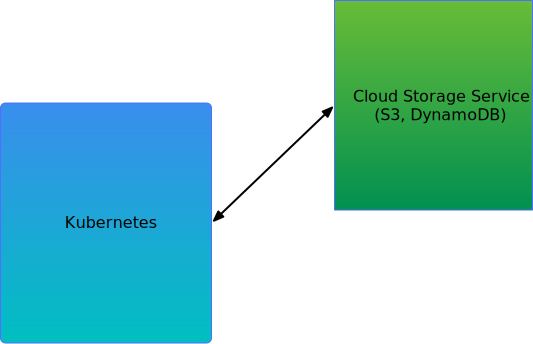
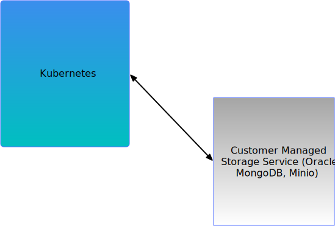
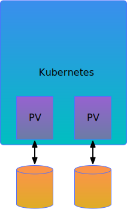

## Overview

Modern distributed applications are complex.  They may consist of containers,
virtual machines, databases, load balancers, Kubernetes namespaces and other
objects.  These applications need to be protected against data loss, service
outages and disasters.  Data protection applications have to contend with
new types of object to protect and the complex topologies of the applications.
Astrolabe is a framework for data protection applications to discover,
backup/replicate data and restore complex applications.  It provides a data
protection-centric model of applications with APIs for snapshotting, data 
extraction, copying and restoration.

The Astrolabe project consists of:

* Kubernetes CRD API (in-progress)
* OpenAPI API specification
* Reference server implementation
* Reference Protected Entity implementations

Please refer to docs/SPEC.md for details of the specification
The REST API is specified in openapi/astrolabe_api.yaml

The reference implementation currently includes support for vSphere virtual disks, a generic "file system" and an S3
generic repository that can be used to store any type of Protected Entity.

# Application models

## Kubernetes Storage Models

### Kubernetes with Cloud Storage
Kubernetes originated as a solution for controlling and managing compute
clusters in a cloud environment.  In this "classic" Kubernetes model, Kubernetes
only manages the compute and stateless aspects of the cluster.  State is stored in
a cloud service, such as S3 or DynamoDB.  

The cloud service is presumed to be reliable
and part of the infrastructure.  In the event of a disaster, infrastructure will be
restored and available before Kubernetes starts.  In this scenario, there is little need
for data protection.  Often, in this model, the type of application does not lend itself
to snapshot and rollback.  It makes no sense, for example, to try to roll Netflix back to
yesterday's state.

### Kubernetes state in Customer Managed Storage Service
In this model, Kubernetes continues to be used for compute.  State is stored in a service
external to Kubernetes, but managed by the customer, such as an RDBMS, NoSQL database or
on-prem object store.

In this configuration, data protection is handled by the administrators of the storage service.
In the event of a disaster, the external service will be restored before the Kubernetes cluster
is brought up.  Snapshotting and versioning may be useful in this scenario and can be handled in the external service.  As long
as the number of external services is small, taking individual snapshots of them can be managed.

As the number of applications or external services grows, however, management of DR
becomes more difficult.  Co-ordinating snapshots becomes an issue and ensuring that all of
the services associated with an application are protected properly becomes more difficult.

### Kubernetes state in Persistent Volumes
In this model, Kubernetes is used for both compute and storage.  

Persistent Volumes are
provided to applications running in Kubernetes and those applications, in turn, may
provide services to other Kubernetes applications (e.g. MongoDB running in K8S used by
the application). Some applications may already have some form of data protection built-in.
Snapshotting and replicating the PV data also provides crash-consistent data protection.

### All of the above

All of the models presented above can be combined, depending on customer choice.

## Non-Kubernetes services

There are numerous data services that exist outside the Kubernetes realm.  These include traditional applications
running on a bare metal server or in a virtual machine, storage/database appliances and cloud services
such as RDS or S3.

## Service Mesh

Service mesh provides another opportunity and challenge.  Service Mesh refers to the collection of
services (micro and otherwise) that are combined together to form an application.  This can include
services running in Kubernetes, in traditional VMs, on bare metal, cloud or proprietary systems.  The
combination of all of these forms the application.  Data Protection needs to apply across all of the
components of the service mesh.

A service mesh can be dynamic with additional services being added or removed at any time.  The
service mesh concept has been formalized with systems such as Istio which monitor and control the network connections
between the various services.  The Istio service mesh can accurately tell us which
services are part of an application because only connections to identified components are allowed.

Service mesh components can be any service which is available via a network connection.  Astrolabe
can leverage a service mesh manager, such as Istio, by mapping the service mesh components to
Astrolabe Protected Entities.
